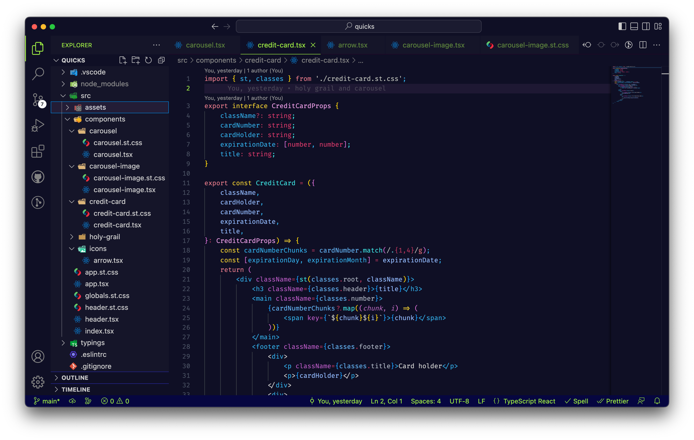

# Theme Burton

A nocturnal VSCode color theme inspired by Tim Burton's imaginative movie worlds, including Edward Scissorhands, Alice in Wonderland, and Charlie and the Chocolate Factory.

### Pun intended.

## Features

- Visually soothing color scheme with a rich color palette
- High contrast syntax highlighting
- Supports multiple programming languages

## Installation

Marketplace

- Navigate to [Visual Studio Marketplace](https://marketplace.visualstudio.com/items?itemName=pshershov.theme-burton)
- Click **Install**
- Click **Set Color Theme**

VSCode

- Launch Visual Studio Code
- Choose **Extensions** from menu
- Search for `Theme Burton` and select it
- Click Install
- Click **Set Color Theme**
